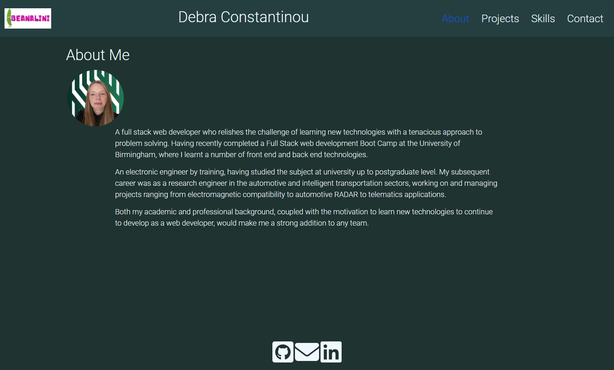
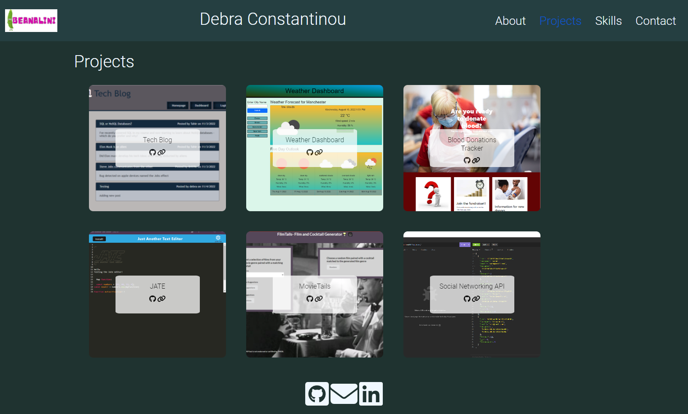
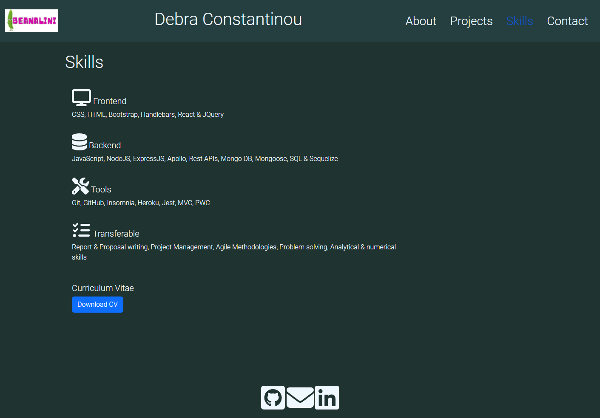
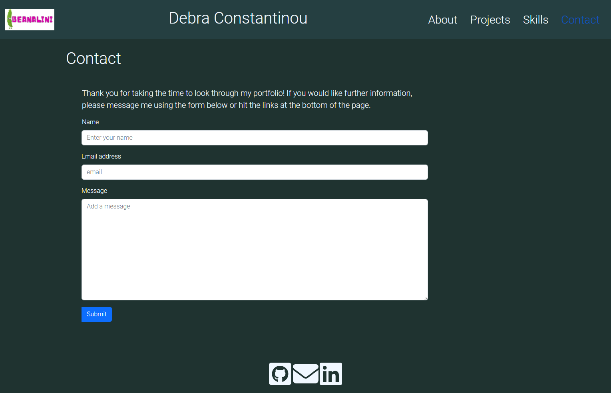

# React Portfolio [](https://opensource.org/licenses/MIT)  
  
  ## Table of Contents  
  * [Description](#description)
  * [Installation](#installation)
  * [Usage](#usage)
  * [Deployed Application](#walk-through-video)
  * [Screen Shots](#screen-shots)
  * [Tests](#tests)
  * [Technologies Used](#technologies-used)
  * [Questions](#questions) 
  * [How to Contribute](#how-to-contribute)   
  * [License](#license)
  
  ## Description
The application developed in this project is a Portfolio that show cases samples of my work.  The portfolio is a responsive single-page application that has been built using React functional components.
         
  ### Functional Requirements

  The functional requirements that React Portfolio has been designed to meet are defined by the user story and acceptance criteria listed below.  

  #### User Story

  ```md
AS AN employer looking for candidates with experience building single-page applications
I WANT to view a potential employee's deployed React portfolio of work samples
SO THAT I can assess whether they're a good candidate for an open position
```
 

#### Acceptance Criteria

```md
GIVEN a single-page application portfolio for a web developer
WHEN I load the portfolio
THEN I am presented with a page containing a header, a section for content, and a footer
WHEN I view the header
THEN I am presented with the developer's name and navigation with titles corresponding to different sections of the portfolio
WHEN I view the navigation titles
THEN I am presented with the titles About Me, Portfolio, Contact, and Resume, and the title corresponding to the current section is highlighted
WHEN I click on a navigation title
THEN I am presented with the corresponding section below the navigation without the page reloading and that title is highlighted
WHEN I load the portfolio the first time
THEN the About Me title and section are selected by default
WHEN I am presented with the About Me section
THEN I see a recent photo or avatar of the developer and a short bio about them
WHEN I am presented with the Portfolio section
THEN I see titled images of six of the developer’s applications with links to both the deployed applications and the corresponding GitHub repositories
WHEN I am presented with the Contact section
THEN I see a contact form with fields for a name, an email address, and a message
WHEN I move my cursor out of one of the form fields without entering text
THEN I receive a notification that this field is required
WHEN I enter text into the email address field
THEN I receive a notification if I have entered an invalid email address
WHEN I am presented with the Resume section
THEN I see a link to a downloadable resume and a list of the developer’s proficiencies
WHEN I view the footer
THEN I am presented with text or icon links to the developer’s GitHub and LinkedIn profiles, and their profile on a third platform (Stack Overflow, Twitter)
```

  ## Installation
  
  After cloning the application follow the instructions below to install the application:

    
  Install dependencies:

       npm i

  To run the application:

    npm run start
  
  The application will run locally on your browser at localhost:3000

 ## Usage


Access the [deployed application](https://beanalini.github.io/react-portfolio/) to view samples of my work.  If you have any questions please contact me using the links provided in the Portfolio application.
  
  
 ## Deployed Application

 To view the React Portfolio click on the link below:

  - [Link to React Portfolio](https://beanalini.github.io/react-portfolio/)
 

   

   

  ## Screen Shots

The following image shows screen shots of my single-page Portfolio Application, which is dynamically updated using React components. 

#### About Me


 

 #### Projects

 


#### Skills
 

#### Contact

 

 


  ## Tests
  No code tests have been implemented.

  ## Technologies Used
  - React
  - Bootstrap
  - HTML
  - CSS
  - JavaScript
  
    
 
  ## Questions
  If you have any questions regarding this project or contents of this repository, please contact me via:
  
  - email: beanalini@outlook.com
  - GitHub: [Beanalini](https://github.com/Beanalini)  


  
  ## How to Contribute
  If you would like to contribute to this project you can contact me by email at dat826@gmail.com or through my GitHub account   @[Beanalini](https://github.com/Beanalini).
  

  ## License
  This project is covered under the MIT License  
  
  [](https://opensource.org/licenses/MIT) 
  